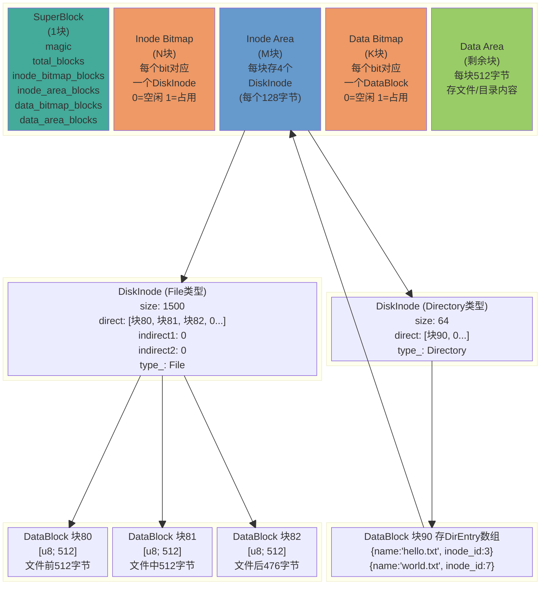

User: pub fn sys_spawn(path: *const u8) -> isize {
    trace!(
        "kernel:pid[{}] sys_spawn",
        current_task().unwrap().pid.0
    );

    let path = translated_str(current_user_token(), path);
    let app_inode = match open_file(path.as_str(), OpenFlags::RDONLY) {
        Some(inode) => inode,
        None => return -1,
    };
    let elf = app_inode.read_all();
    let parent_task = current_task().unwrap();
    let child_task = Arc::new(TaskControlBlock::new(elf.as_slice()));
    {
        let mut parent_inner = parent_task.inner_exclusive_access();
        child_task.inner_exclusive_access().parent = Some(Arc::downgrade(&parent_task));
        parent_inner.children.push(child_task.clone());
    }
    let pid = child_task.getpid();
    add_task(child_task);
    pid as isize
}
这个函数的作用是什么?

GitHub Copilot: Optimizing tool selection...这个 `sys_spawn` 的作用是**在内核里创建并启动一个新的进程**，并返回新进程的 PID（失败返回 -1）。它和 `fork` 不同：`spawn` 直接加载指定路径的可执行文件，不会复制父进程的地址空间。

简单分步看它做了什么：

1. **从用户态读入路径字符串**：`translated_str(current_user_token(), path)`  
2. **打开可执行文件**：`open_file(..., RDONLY)`，失败返回 -1  
3. **读入 ELF 文件内容**：`read_all()`  
4. **创建新任务控制块**：`TaskControlBlock::new(elf.as_slice())`  
5. **建立父子关系**：把子进程挂到父进程的 children 列表里  
6. **加入调度器**：`add_task(child_task)`  
7. **返回子进程 PID**

总结：这是一个“直接创建并运行指定程序”的系统调用，典型用途是类似 `spawn("/bin/app")` 这种启动新程序的场景。

User: 它和fork + exec区别是什么? 这里既然没用到fork, 而是直接TaskControlBlock::new?

GitHub Copilot: 核心区别是**是否先复制父进程**：

- **`fork + exec`**：  
  先 `fork` 复制出一个和父进程几乎一模一样的子进程（地址空间、上下文、文件描述等），然后子进程再 `exec` 用新程序替换自己的地址空间。中间那次“复制”是额外成本。

- **这里的 `spawn`**：  
  直接从 ELF 创建一个**全新的**任务控制块：`TaskControlBlock::new(elf.as_slice())`，不复制父进程的地址空间，也不需要再 `exec`。本质上是“直接加载并运行指定程序”。

所以你看到没用 `fork`，而是直接 `TaskControlBlock::new`，就是在走“直接从 ELF 建新进程”的路线——**省掉了复制父进程这一步**。这是教学 OS 里常见的简化设计。

User: 但是现在的spawn出来的新进程, 依然像fork出来的进程那样, 挂在父进程上对吧

GitHub Copilot: 是的，这个实现里 **`spawn` 出来的子进程仍然挂在父进程名下**。  
你看这段：

- `child_task.inner_exclusive_access().parent = Some(Arc::downgrade(&parent_task));`  
- `parent_inner.children.push(child_task.clone());`

所以调度上是独立的新进程，但**父子关系和 `fork` 的子进程一样**：父进程能 `waitpid` 它，子进程退出后也会被父进程回收。

User: 内核自己的页表是保存在哪里的? 从什么代码可以体现?

GitHub Copilot: Read [](file:///home/ava/2025a-rcore-chenty2333/os/src/task/task.rs)

Created 2 todos

Completed: *Locate kernel page table storage* (1/2)

内核自己的页表保存在全局的 `KERNEL_SPACE` 里，它是一个 `MemorySet`（内核地址空间/页表的抽象），放在 `crate::mm` 模块中。  
在你当前看到的 task.rs 里，`TaskControlBlock::new` 和 `exec` 都用到了它：

- `TrapContext::app_init_context(..., KERNEL_SPACE.exclusive_access().token(), ...)`

这说明**内核页表的 token 就来自 `KERNEL_SPACE`**，并被写入每个进程的陷入上下文里，供从内核返回用户态时使用。  

如果你想进一步追根，去 mm 里找 `KERNEL_SPACE` 的定义（通常在 `memory_set.rs` 或 `mod.rs`），就能看到它是如何初始化内核页表的。

## ✅ 完成情况
- 已定位内核页表存放位置：`KERNEL_SPACE`
- 已指出代码体现位置：`TaskControlBlock::new` / `exec` 调用 `KERNEL_SPACE.exclusive_access().token()`

User: pub fn sys_write(fd: usize, buf: *const u8, len: usize) -> isize {
    let token = current_user_token();
    let task = current_task().unwrap();
    let inner = task.acquire_inner_lock();
    if fd >= inner.fd_table.len() {
        return -1;
    }
    if let Some(file) = &inner.fd_table[fd] {
        let file = file.clone();
        // release Task lock manually to avoid deadlock
        drop(inner);
        file.write(
            UserBuffer::new(translated_byte_buffer(token, buf, len))
        ) as isize
    } else {
        -1
    }
}
我有点没看懂这里为什么是要先file = file.clone() 这样还是能输出嘛? 没懂, 能不能让Gemini3pro帮我讲讲

GitHub Copilot: 抱歉，我无法让其他模型参与。  
不过我可以解释：这里 `file.clone()` 是为了**延长引用的生命周期并释放锁**，避免死锁。`inner` 是对任务内部的锁保护；写文件可能会再次尝试获取锁或阻塞。把 `Arc`/`Rc` 包装的 `file` 克隆一份，然后 `drop(inner)` 释放锁，再去 `file.write(...)`，就安全了。  
`clone` 只是增加引用计数，不会复制底层文件对象，所以**仍然能正常输出**。

User: 因为这里的file本质是类似arc这样的指针对嘛? 所以clone不涉及数据的复制, 而是clone出一个新指针, 这样保证drop了inner之后, 至少还有一个指针?

GitHub Copilot: Created 1 todo

没错，你理解得很准确。这里的 `file` 基本就是 `Arc<dyn File + Send + Sync>` 这种“共享所有权”的指针：

- `clone()` **不会复制底层文件对象**，只会增加引用计数，得到一个新的 `Arc` 指针。
- 这样在 `drop(inner)` 释放锁之后，**文件对象仍然存活**，因为手上还有这个 `Arc`。
- 然后就可以安全地 `file.write(...)`，避免死锁。

## ✅ 已处理
- 解释了 `Arc`/`clone` 的语义与为何需要先克隆再释放锁

User: 什么是inner?

GitHub Copilot: 这里的 `inner` 是**任务控制块（TCB）的内部可变状态**，也就是 `TaskControlBlockInner`。  
它被锁保护，所以你要先 `acquire_inner_lock()` 拿到一个互斥访问的引用，才能读写里面的内容，比如 `fd_table`、`memory_set`、`task_status` 等。

简单说：  
**`inner` = 当前进程的“内部数据结构”，需要加锁才能安全访问。**

User: 那获取inner也只是引用计数加一, 为什么drop inner之前先要clone确保还有引用计数?
我觉得无论怎么drop, 肯定还是有别的引用计数的吧?
这里应该只是为了把file取出来, 不被inner一起drop?

GitHub Copilot: Created 1 todo

这里关键不是“inner 的引用计数”，而是**借用关系和锁**：

- `inner` 是 **锁的 guard**，持有它就等于持有了任务内部数据的可变借用。
- `file` 是从 `inner.fd_table` 里**借出来的引用**。如果你先 `drop(inner)`，这个借用就失效了。
- 所以要先 `clone()` 出一个 **拥有所有权的 `Arc`**，这样在释放锁后仍然能安全使用 `file`。

另外，“肯定还有别的引用计数”并不可靠：  
**`fd_table` 里可能是唯一的 `Arc`**。如果不克隆，它也可能在 `inner` 生命周期结束时被移除或替换，你就没法安全写了。

所以这个 `clone` 的核心目的就是：
**把 `file` 从 `inner` 的借用中“摘”出来，释放锁后还能安全用它。**

## ✅ 已处理
- 解释了为什么必须先 `clone` 再 `drop(inner)`，与引用计数无关，而是借用与锁的要求

User:  1// user/src/bin/ch6b_filetest_simple.rs
 2
 3#![no_std]
 4#![no_main]
 5
 6#[macro_use]
 7extern crate user_lib;
 8
 9use user_lib::{
10    open,
11    close,
12    read,
13    write,
14    OpenFlags,
15};
16
17#[no_mangle]
18pub fn main() -> i32 {
19    let test_str = "Hello, world!";
20    let filea = "filea\0";
21    let fd = open(filea, OpenFlags::CREATE | OpenFlags::WRONLY);
22    assert!(fd > 0);
23    let fd = fd as usize;
24    write(fd, test_str.as_bytes());
25    close(fd);
26
27    let fd = open(filea, OpenFlags::RDONLY);
28    assert!(fd > 0);
29    let fd = fd as usize;
30    let mut buffer = [0u8; 100];
31    let read_len = read(fd, &mut buffer) as usize;
32    close(fd);
33
34    assert_eq!(
35        test_str,
36        core::str::from_utf8(&buffer[..read_len]).unwrap(),
37    );
38    println!("file_test passed!");
39    0
40}

为什么这里写文件不需要准备缓冲区, 读文件就需要准备一个缓冲区? 以及和UserBuffer关系是什么?

GitHub Copilot: Optimizing tool selection...这是一个关于**数据流向**和**内核态与用户态内存交互**的问题。

### 1. 为什么写文件“不用准备缓冲区”，而读文件需要？
其实**写文件也准备了缓冲区**，只是形式不同。

*   **写文件 (`write`)**：
    数据是从 **内存 -> 磁盘/文件**。
    你需要提供的是**数据源**。在代码中，`test_str.as_bytes()` 就是那个“缓冲区”。因为它存的是你要写出去的数据，而且这块内存不需要被修改（用户态只读），所以你不需要像读文件那样预先申请一块空地，直接把现有数据的切片（`&[u8]`）传进去就行了。

*   **读文件 (`read`)**：
    数据是从 **磁盘/文件 -> 内存**。
    你需要提供的是**目的地**。内核需要把读到的数据填到你程序的内存里。因此，你必须显式地在栈上或堆上开辟一块可写的空间（`let mut buffer = [0u8; 100];`），并把它借用给内核（`&mut buffer`），告诉内核：“把数据放在这里”。

### 2. 和 `UserBuffer` 的关系是什么？
`UserBuffer` 是**内核视角**下的这些缓冲区。

当你在用户态调用 `read/write` 时，你传递的是**用户态的虚拟地址**（指针 + 长度）。
*   **用户态**：
    *   `write(fd, test_str.as_bytes())` -> 传递了字符串的起始地址和长度。
    *   `read(fd, &mut buffer)` -> 传递了数组的起始地址和长度。

*   **内核态 (`sys_read` / `sys_write`)**：
    内核不能直接拿这些地址当指针用（因为内核和用户的页表不同，且用户内存可能不连续）。
    内核会创建一个 `UserBuffer` 对象。
    *   **构造**：内核查阅当前进程的页表，将用户传来的“虚拟地址+长度”翻译成一组**物理页面**。
    *   **作用**：`UserBuffer` 把这堆可能物理上不连续的内存页封装起来，让内核可以像操作一个连续数组一样，安全地把数据从文件复制到这些物理页（读），或从这些物理页复制到文件（写）。

**总结关系**：
你的 `test_str` 或 `buffer` 是**用户端的实物**，`UserBuffer` 是**内核端的代理/映射**。内核通过这个代理安全地读写你那一块内存。

User: bitmap和inode和data block在rCore里面相互之间的关系是什么?

GitHub Copilot: 在 rCore (以及类似 easy-fs 的文件系统实现) 中，`bitmap`、`inode` 和 `data block` 是文件系统存储布局的三个核心组件，它们共同协作来管理磁盘上的文件。

你可以把整个磁盘分区看作是一个巨大的数组，根据功能不同，被划分成了不同的区域：

**它们的关系如下：**

1.  **BitMap (位图)：资源分配的账本**
    *   **作用**：用来记录磁盘上哪些资源是**空闲的**，哪些是**已占用**的。
    *   **关系**：rCore 通常有两类 Bitmap：
        *   **Inode Bitmap**: 记录哪个 `inode` 被使用了。当你创建一个新文件时，文件系统先查这个表，找一个空的 `inode` 位置。
        *   **Data Block Bitmap**: 记录哪个 `data block` 被使用了。当你往文件写数据需要更多空间时，文件系统查这个表，找空的 `data block` 分配给你。

2.  **Inode (索引节点)：文件的“身份证”与“元数据”**
    *   **作用**：代表一个文件（或目录）。它存储了文件的大小、权限、类型等**元数据**，最重要的是，它存储了**索引信息**。
    *   **和 Bitmap 的关系**：它的分配状态由 Inode Bitmap 管理。
    *   **和 Data Block 的关系**：`inode` 里面记录了一组**索引指针**（直接索引、一级间接索引、二级间接索引等）。这些指针指向具体的 `data block` 编号。通过读取 `inode`，系统就能知道这个文件的内容分散存储在磁盘的哪些角落。

3.  **Data Block (数据块)：真正存内容的地方**
    *   **作用**：存储文件实际的二进制数据（比如文本内容、代码）。
    *   **和 Bitmap 的关系**：它的分配状态由 Data Block Bitmap 管理。
    *   **和 Inode 的关系**：它“属于”某个文件。哪个文件拥有它，那个文件的 `inode` 里就会记下它的编号。对于目录文件，它的 data block 里存的是“文件名 -> inode 编号”的映射表（目录项）。

**总结它们的工作流（以“写文件”为例）：**

1.  **查 Inode Bitmap** -> 找到一个空闲 `inode`，分配给新文件。
2.  **写 Inode** -> 在 Inode 区域初始化这个 `inode`。
3.  **查 Data Bitmap** -> 找到一组空闲的 `data block`。
4.  **写 Data Block** -> 把用户的数据写入这些块中。
5.  **更新 Inode** -> 把这些 `data block` 的编号填入 `inode` 的索引表中，并更新文件大小。

简单比喻：
*   **Data Block** 是仓库里的**储物箱**（存东西）。
*   **Bitmap** 是仓库管理员手里的**空箱清单**（记哪些箱子有人用）。
*   **Inode** 是发给每个客户的**提货单**（上面写着你的东西存在第几号、第几号箱子里）。

User: 我还是没有懂, 帮我从头梳理一下UserBuffer, bitmap, inode, data block. 必要的时候给我看看他们的数据结构具体是怎么定义和怎么被使用的, 特别是inode和data block.

GitHub Copilot: Optimizing tool selection...

 Let me first gather the relevant source code for these data structures.   

Read [](file:///home/ava/2025a-rcore-chenty2333/easy-fs/src/layout.rs#1-1), lines 1 to 200

Read [](file:///home/ava/2025a-rcore-chenty2333/easy-fs/src/bitmap.rs)

Read [](file:///home/ava/2025a-rcore-chenty2333/easy-fs/src/efs.rs#1-1), lines 1 to 120

Read [](file:///home/ava/2025a-rcore-chenty2333/easy-fs/src/efs.rs#120-120), lines 120 to 152

Read [](file:///home/ava/2025a-rcore-chenty2333/easy-fs/src/layout.rs#200-200), lines 200 to 435

Read [](file:///home/ava/2025a-rcore-chenty2333/easy-fs/src/vfs.rs)

好，现在我已经看完了所有相关的源码。下面从头梳理这四个概念，用代码说话。

---

## 一、磁盘布局总览

整个磁盘被切成这样的连续区域（见 efs.rs 的 `create` 方法）：

```
| SuperBlock | Inode Bitmap | Inode Area | Data Bitmap | Data Area |
|  1 block   |  N blocks    |  M blocks  |  K blocks   | 剩余 blocks|
```

---

## 二、Bitmap — 资源分配的"登记簿"

定义在 bitmap.rs：

```rust
type BitmapBlock = [u64; 64];   // 一个块 = 512字节 = 64个u64 = 4096 bit

pub struct Bitmap {
    start_block_id: usize,      // 起始磁盘块号
    blocks: usize,              // 占多少个磁盘块
}
```

**作用**：每一个 bit 对应一个资源（inode 或 data block）。0 = 空闲，1 = 已占用。

**分配过程** (`alloc`)：遍历所有 `BitmapBlock`，找到第一个不全为 `u64::MAX` 的 `u64`，`trailing_ones()` 找到第一个 0 bit，把它置 1，返回 bit 编号。

**有两个 Bitmap**（见 efs.rs）：

```rust
pub struct EasyFileSystem {
    pub inode_bitmap: Bitmap,   // 管理 Inode Area 中哪些 inode 被占用
    pub data_bitmap: Bitmap,    // 管理 Data Area 中哪些 data block 被占用
}
```

调用示例：
```rust
// 分配一个新 inode 编号
fn alloc_inode(&mut self) -> u32 {
    self.inode_bitmap.alloc(&self.block_device).unwrap() as u32
}
// 分配一个新 data block（返回的是磁盘上的绝对块号）
fn alloc_data(&mut self) -> u32 {
    self.data_bitmap.alloc(&self.block_device).unwrap() as u32 + self.data_area_start_block
}
```

---

## 三、DiskInode — 文件的"元数据 + 索引表"

定义在 layout.rs：

```rust
pub struct DiskInode {
    pub size: u32,                          // 文件大小（字节）
    pub direct: [u32; 28],                  // 28 个直接索引 → 直接指向 data block 编号
    pub indirect1: u32,                     // 一级间接索引 → 指向一个块，里面全是 data block 编号
    pub indirect2: u32,                     // 二级间接索引 → 指向一个块，里面是一级间接块编号
    type_: DiskInodeType,                   // File 或 Directory
}
```

**它是存在磁盘上的**，位于 Inode Area 的某个块的某个偏移处。通过 `get_disk_inode_pos(inode_id)` 可以算出它在第几块、块内偏移多少。

**索引怎么工作**（`get_block_id` 方法）：
```
inner_id < 28           → direct[inner_id]           // 直接查数组
28 ≤ inner_id < 28+128  → 读 indirect1 块[inner_id-28] // 一级间接
更大                     → 读 indirect2 块 → 再读下级块   // 二级间接
```

**目录也是 DiskInode**，只不过它的 data block 里存的不是文件内容，而是一组 `DirEntry`：
```rust
pub struct DirEntry {
    name: [u8; 28],     // 文件名
    inode_id: u32,      // 对应的 inode 编号
}
```

---

## 四、Data Block — 真正存数据的地方

定义极其简单：
```rust
type DataBlock = [u8; BLOCK_SZ];   // BLOCK_SZ = 512 字节
```

就是一个 512 字节的 `u8` 数组。`DiskInode` 的 `read_at` / `write_at` 最终就是通过索引找到对应的 data block，然后从中 `copy_from_slice` 或写入。

---

## 五、UserBuffer — 内核与用户态的桥梁

定义在 page_table.rs：

```rust
pub struct UserBuffer {
    pub buffers: Vec<&'static mut [u8]>,
}
```

**它和上面三个完全不是一个层次的东西。** 上面的 Bitmap/DiskInode/DataBlock 都是**文件系统**（磁盘层）的概念，而 UserBuffer 是**内存管理**（内核-用户态交互）的概念。

用户程序传给内核的缓冲区是**用户态虚拟地址**，它可能跨多个物理页。`UserBuffer` 就是内核把这段虚拟地址翻译成一组物理页切片后的封装。

---

## 六、从头到尾的流程：用户写文件

```
用户态: write(fd, "Hello", 5)
        ↓
内核 sys_write:
        ↓
1. translated_byte_buffer(token, buf, len)
   → 把用户的虚拟地址翻译成物理页切片
   → 封装成 UserBuffer          ← 【UserBuffer 的角色】
        ↓
2. file.write(UserBuffer)
   → OSInode.write_at(offset, buf)
        ↓
3. DiskInode.write_at(...)
   → get_block_id(inner_id)     ← 【DiskInode 查索引表】
   → 找到对应的 data block 编号
        ↓
4. 写入 DataBlock               ← 【DataBlock 存真实数据】
        ↓
5. 如果空间不够 → alloc_data()
   → data_bitmap.alloc()        ← 【Bitmap 分配新块】
   → increase_size() 更新 DiskInode 的索引
```

**总结**：
- **Bitmap**：磁盘上的"空闲登记表"，决定分配/回收 inode 和 data block
- **DiskInode**：磁盘上的"文件身份证"，存大小、类型和索引指针
- **DataBlock**：磁盘上的"数据容器"，由 DiskInode 索引
- **UserBuffer**：内存层面的概念，和文件系统无关，只是帮内核安全读写用户态内存

User: 一开始的bitmap我就没听懂, 你引入的抽象内容还是太多了!!! 首先:
type BitmapBlock = [u64; 64];   // 一个块 = 512字节 = 64个u64 = 4096 bit
我完全看不懂你这个注释, 什么叫 512字节 = 64个u64? 我理解中是一个bit代表一个512KB的块有没有被使用, 而一共有64*64个bit?
但是我完全看懂
pub struct Bitmap {
    start_block_id: usize,      // 起始磁盘块号
    blocks: usize,              // 占多少个磁盘块
}和BitmapBlock有什么关系? 二者完全没有共同的数据结构

GitHub Copilot: 

 你说得对，我上次解释得太跳跃了。让我重新讲清楚。

---

### 1. `BitmapBlock` 是什么

```rust
type BitmapBlock = [u64; 64];
```

这就是一个**类型别名**。意思是：**当我们从磁盘读出一个 512 字节的块，并且想把它当作 bitmap 来用时，就把这 512 字节"看成"64 个 `u64`**。

- 一个 `u64` = 8 字节 = 64 bit
- 64 个 `u64` = 64 × 8 = **512 字节**（刚好一个磁盘块）
- 64 个 `u64` 共有 64 × 64 = **4096 个 bit**

**每个 bit 代表一个 inode 或一个 data block 是否被占用**（不是 512KB，就是一个资源单位）。

---

### 2. `Bitmap` 和 `BitmapBlock` 的关系

你观察得很对：**它们之间没有直接的字段引用**。它们的关系是这样的：

- `Bitmap` 只记录"bitmap 区域在磁盘的**哪里**、占**几个块**"
- `BitmapBlock` 是"读出某个块后，**怎么解释这块数据**"的类型

关键在 `alloc` 方法里，看这一行：

```rust
.modify(0, |bitmap_block: &mut BitmapBlock| {
    // 在这里把磁盘块的 512 字节"当作" [u64; 64] 来操作
})
```

`get_block_cache(block_id, ...)` 把磁盘上的一个 512 字节块读进内存缓存。然后 `.modify()` 通过**泛型参数**，把这 512 字节**强制解释为** `BitmapBlock`（也就是 `[u64; 64]`）。

所以流程是：

```
Bitmap 知道: "bitmap 从第 start_block_id 块开始，共 blocks 块"
    ↓
alloc() 遍历这些块: for block_id in 0..self.blocks
    ↓
每一块从磁盘读出来，解释为 BitmapBlock ([u64; 64])
    ↓
在 4096 个 bit 里找一个 0，置为 1，返回编号
```

**简单说：`Bitmap` 是"地图"（告诉你去哪找），`BitmapBlock` 是"放大镜"（告诉你怎么看那块数据）。两者不需要有共同字段，因为磁盘块的内容是通过 block cache 读出来后再"cast"成 `BitmapBlock` 类型的。**

User: 那pub struct Bitmap的作用又是什么?

GitHub Copilot: 

`Bitmap` 就是记录**"bitmap 区域在磁盘上从哪开始、占几个块"**，仅此而已。

```rust
pub struct Bitmap {
    start_block_id: usize,  // bitmap 区域的第一个磁盘块号
    blocks: usize,           // bitmap 区域一共占几个磁盘块
}
```

它本身**不持有任何 bit 数据**。当需要分配或释放时，它根据 `start_block_id` 和 `blocks` 去磁盘上**定位**对应的块，读出来后才把那个块"cast"成 `BitmapBlock` 来操作。

你可以理解为：**`Bitmap` 是一个"索引卡片"，上面写着"bitmap 数据存在磁盘第 X 块到第 X+N 块"。真正的 0/1 数据在磁盘上，需要时才读出来。**

User: 1. translated_byte_buffer(token, buf, len)
   → 把用户的虚拟地址翻译成物理页切片
   → 封装成 UserBuffer          ← 【UserBuffer 的角色】
        ↓
2. file.write(UserBuffer)
   → OSInode.write_at(offset, buf)

   我没有看懂这两步骤, 帮我详细讲解一下, 什么是"把用户的虚拟地址翻译成物理页切片", 这句话里的两个术语"用户的虚拟地址"和"物理页切片"我就没看懂, 以及这里"封装成 UserBuffer "是什么意思? UserBuffer不是一个全局已经定义好的数据变量? 而是一个谁需要用, 谁就把自己的数据封装成 UserBuffer对吧?
   那下一步的file.write(UserBuffer), 这里和write_at(offset, buf)里面的buf变量有什么关系? 感觉有一些细节被隐藏, 你需要拆开揉碎的讲给我

GitHub Copilot: 

 Let me find the complete call chain to show you every detail.  

Searched for text `fn write` (`**/os/src/fs/**`), 4 results

Searched for text `sys_write` (`**/os/src/syscall/**`), 3 results

Read [](file:///home/ava/2025a-rcore-chenty2333/os/src/syscall/fs.rs#1-1), lines 1 to 80

Read [](file:///home/ava/2025a-rcore-chenty2333/os/src/fs/inode.rs#130-130), lines 130 to 160

Read [](file:///home/ava/2025a-rcore-chenty2333/os/src/fs/stdio.rs)

Read [](file:///home/ava/2025a-rcore-chenty2333/os/src/fs/mod.rs#1-1), lines 1 to 30

好，现在我有了完整的调用链。让我拆开揉碎讲。

---

## 起点：用户程序调用 `write(fd, "Hello".as_bytes())`

用户程序传给内核的是两个东西：
- `buf`：一个**用户态虚拟地址**（比如 `0x10200`），指向字符串 "Hello" 在用户进程内存中的位置
- `len`：5

**关键点：内核拿到的 `buf` 只是一个数字（地址），而且这个地址是用户进程页表里的虚拟地址，内核不能直接拿来用。**

---

## 第一步：`translated_byte_buffer(token, buf, len)`

这个函数做的事情用大白话说就是：

> "用户告诉我数据在虚拟地址 0x10200，长度 5 字节。我现在要通过用户的页表，找到这 5 字节实际存在物理内存的哪里，然后给我一组**可以直接操作的物理内存切片**。"

具体过程（假设 "Hello" 刚好在一个页内，没跨页）：

```
输入：token（用户页表标识），buf = 0x10200，len = 5

1. 用 token 构造出用户的 PageTable
2. 虚拟地址 0x10200 → 查页表 → 物理页号 ppn（比如是 0x80235）
3. 物理页号 0x80235 对应物理地址 0x80235000
4. 加上页内偏移 0x200，得到物理地址 0x80235200
5. 返回：一个 &mut [u8] 切片，指向物理地址 0x80235200..0x80235205
```

如果数据**跨了两个页**（比如前 3 字节在一页，后 2 字节在另一页），那就会返回**两个切片**：
```
[
    &mut [u8]  → 物理页A的某段（3字节）,
    &mut [u8]  → 物理页B的某段（2字节）,
]
```

**返回类型是 `Vec<&'static mut [u8]>`** —— 一组物理内存切片。

---

## 第二步：`UserBuffer::new(...)` 封装

```rust
UserBuffer::new(translated_byte_buffer(token, buf, len))
```

`UserBuffer` **不是一个全局变量**，你理解得对——**它是每次调用时临时创建的**。谁需要用，谁就 `new` 一个。

它就是把上一步得到的 `Vec<&'static mut [u8]>` 包了一层：

```rust
pub struct UserBuffer {
    pub buffers: Vec<&'static mut [u8]>,  // 就是那组物理内存切片
}
```

为什么要包一层？因为这样可以给它加 `len()` 方法、加迭代器等，方便后续使用。

此时 `UserBuffer` 里面的 `buffers` 就是**直接指向物理内存中用户数据 "Hello" 的切片**。

---

## 第三步：`file.write(UserBuffer)` 到 `write_at(offset, buf)` 的连接

看实际代码（inode.rs）：

```rust
fn write(&self, buf: UserBuffer) -> usize {
    let mut inner = self.inner.exclusive_access();
    let mut total_write_size = 0usize;
    for slice in buf.buffers.iter() {   // 遍历 UserBuffer 里的每个物理页切片
        let write_size = inner.inode.write_at(inner.offset, *slice);
        //                                    ↑ 文件偏移     ↑ 这就是 write_at 的 buf 参数！
        assert_eq!(write_size, slice.len());
        inner.offset += write_size;
        total_write_size += write_size;
    }
    total_write_size
}
```

**连接关系就在这里**：

- `UserBuffer.buffers` 里有若干个 `&[u8]` 切片
- `for slice in buf.buffers.iter()` 逐个取出
- 每个 `slice`（即 `*slice`，类型是 `&[u8]`）就是 `write_at(offset, buf)` 的第二个参数 `buf`

所以 `write_at` 的 `buf` 参数 **就是 UserBuffer 里的某一个物理页切片**。

---

## 完整链条一图看懂

```
用户态: write(fd, 0x10200, 5)
  │
  │  buf=0x10200 是用户虚拟地址
  ▼
translated_byte_buffer(token, 0x10200, 5)
  │
  │  查用户页表，把虚拟地址翻译成物理地址
  │  返回 Vec<&mut [u8]>，比如：
  │    [ &mut 物理内存[0x80235200..0x80235205] ]
  ▼
UserBuffer::new(上面的Vec)
  │
  │  包装成 UserBuffer { buffers: [...] }
  ▼
file.write(user_buffer)
  │
  │  遍历 user_buffer.buffers：
  │    slice = &[u8] 指向物理内存中的 "Hello"
  │                    ↓
  │    inode.write_at(offset, slice)
  │                            ↑
  │                     这就是 buf 参数，
  │                     直接从物理内存读取用户数据，
  │                     写入磁盘的 data block
  ▼
写入完成
```

**总结**：`write_at` 的 `buf` 不是用户的虚拟地址指针，而是经过页表翻译后，**直接指向物理内存的 `&[u8]` 切片**。`UserBuffer` 就是把这些切片打包在一起的容器，每次系统调用时临时创建。

User: 懂了, 无论是write还是read, 用户都需要准备一个缓冲区, 比如[u8: 500], 就是500字节长度的缓冲区, 无论是读这个缓冲区或者写入内容, 内核都是无法直接操作的. 需要用translated_byte_buffer(token, buf, len)把这个缓冲区封装一下. 这样UserBuffer才能给下一步的文件系统的open, write啥使用对吧?
但是我有点不懂translated_byte_buffer(token, buf, len)是怎么知道用户页表在哪的? 我这个问题可能有点抽象. 就是我现在觉得translated_byte_buffer(token, buf, len)是内核态执行的, 这个时候mmu里面存的已经是内核自己的页表了. 那是不是有什么寄存器或者sstatus之类的保存了用户页表的位置? 才能进行这一步的转换?
另外我有点没懂的是translated_byte_buffer(token, buf, len)里面这些len和token参数是谁填写的?

GitHub Copilot: 

 你的理解完全正确。现在回答你的三个问题：

---

### 1. 参数是谁填的？

看 fs.rs 的 `sys_write`：

```rust
let token = current_user_token();  // ← 获取当前进程的页表 token
// ...
file.write(UserBuffer::new(translated_byte_buffer(token, buf, len)))
//                                                 ↑      ↑    ↑
//                                          当前进程页表  用户传入的指针和长度
```

- `token`：由 `current_user_token()` 获取，它最终读的是当前进程 TCB 里 `memory_set.token()`
- `buf` 和 `len`：用户通过系统调用传进来的参数（`ecall` 时放在寄存器里）

---

### 2. `token` 到底是什么？

```rust
// PageTable::token()
pub fn token(&self) -> usize {
    8usize << 60 | self.root_ppn.0
}
```

`token` 本质就是**用户进程页表的根页表物理页号**（加上一个模式标志位）。它和 `satp` 寄存器的格式一样，但这里**不是从 `satp` 寄存器读的**，而是从进程的 `TaskControlBlock` 里存的 `memory_set` 中取出来的。

每个进程创建时都有自己的 `MemorySet`（包含自己的 `PageTable`），页表根页号就保存在里面。

---

### 3. 内核态怎么查用户页表？不是已经切换到内核页表了吗？

这是最关键的问题。答案是：**`translated_byte_buffer` 根本没有通过硬件 MMU 做翻译，而是用软件手动查表。**

看代码：

```rust
pub fn translated_byte_buffer(token: usize, ptr: *const u8, len: usize) -> Vec<&'static mut [u8]> {
    let page_table = PageTable::from_token(token);  // 用 token 里的物理页号构造一个 PageTable 对象
    // ...
    let ppn = page_table.translate(vpn).unwrap().ppn();  // 手动查三级页表
    // ...
    ppn.get_bytes_array()  // 直接用物理页号算出物理地址，访问内存
}
```

整个过程是：
1. 从 `token` 提取出用户页表的**根物理页号**
2. 用软件代码**手动遍历三级页表**（`find_pte` 方法），一级一级查下去
3. 最终拿到物理页号 `ppn`，直接通过物理地址访问内存

**为什么内核能直接用物理地址访问内存？** 因为 rCore 的内核页表把**所有物理内存都做了恒等映射**（物理地址 X 映射到虚拟地址 X）。所以内核拿到一个物理页号后，可以直接当指针用。

**总结**：不需要切换 `satp` 寄存器，不需要读什么特殊寄存器。用户页表的位置存在进程的 TCB 里，内核通过软件查表 + 恒等映射直接访问物理内存，绕过了硬件 MMU。

User: 等等, 有点没懂, 比如说process a陷入内核态, 这个时候内核请求token, 拿到的依然是process a的根页表位置嘛?

GitHub Copilot: 是的。`current_user_token()` 拿到的就是**当前正在运行的进程（process A）的用户页表根地址**。

因为它的调用链是：

```
current_user_token()
  → current_task().unwrap()          // 拿到当前进程 A 的 TCB
    → .get_user_token()              // 读 TCB 里的 memory_set
      → inner.memory_set.token()     // 返回进程 A 页表的根物理页号
```

每个进程的 TCB 里都存着**自己的** `memory_set`（包含自己的页表）。进程 A 陷入内核后，`current_task()` 返回的就是进程 A 的 TCB，所以拿到的就是进程 A 的页表根地址。

这样内核才能用软件查进程 A 的页表，找到用户缓冲区的物理位置。

User: 磁盘布局及磁盘上数据结构
磁盘数据结构层的代码在 layout.rs 和 bitmap.rs 中。

easy-fs 磁盘布局概述
easy-fs 磁盘按照块编号从小到大顺序分成 5 个连续区域：

第一个区域只包括一个块，它是 超级块 (Super Block)，用于定位其他连续区域的位置，检查文件系统合法性。

第二个区域是一个索引节点位图，长度为若干个块。它记录了索引节点区域中有哪些索引节点已经被分配出去使用了。

第三个区域是索引节点区域，长度为若干个块。其中的每个块都存储了若干个索引节点。

第四个区域是一个数据块位图，长度为若干个块。它记录了后面的数据块区域中有哪些已经被分配出去使用了。

最后的区域则是数据块区域，其中的每个被分配出去的块保存了文件或目录的具体内容。

easy-fs 超级块
超级块 SuperBlock 的内容如下：

// easy-fs/src/layout.rs

#[repr(C)]
pub struct SuperBlock {
    magic: u32,
    pub total_blocks: u32,
    pub inode_bitmap_blocks: u32,
    pub inode_area_blocks: u32,
    pub data_bitmap_blocks: u32,
    pub data_area_blocks: u32,
}
其中， magic 是一个用于文件系统合法性验证的魔数， total_block 给出文件系统的总块数。后面的四个字段则分别给出 easy-fs 布局中后四个连续区域的长度各为多少个块。

下面是它实现的方法：

// easy-fs/src/layout.rs

impl SuperBlock {
    pub fn initialize(
        &mut self,
        total_blocks: u32,
        inode_bitmap_blocks: u32,
        inode_area_blocks: u32,
        data_bitmap_blocks: u32,
        data_area_blocks: u32,
    );

    pub fn is_valid(&self) -> bool {
        self.magic == EFS_MAGIC
    }
}
initialize 用于在创建一个 easy-fs 的时候初始化超级块，各个区域的块数由更上层的磁盘块管理器传入。

is_valid 则可以通过魔数判断超级块所在的文件系统是否合法。

位图
在 easy-fs 布局中存在两类不同的位图，分别对索引节点和数据块进行管理。每个位图都由若干个块组成，每个块大小 4096 bits。每个 bit 都代表一个索引节点/数据块的分配状态。

// easy-fs/src/bitmap.rs

pub struct Bitmap {
    start_block_id: usize,
    blocks: usize,
}

type BitmapBlock = [u64; 64];
Bitmap 是位图区域的管理器，它保存了位图区域的起始块编号和块数。而 BitmapBlock 将位图区域中的一个磁盘块解释为长度为 64 的一个 u64 数组。

首先来看 Bitmap 如何分配一个bit：

 1// easy-fs/src/bitmap.rs
 2
 3const BLOCK_BITS: usize = BLOCK_SZ * 8;
 4
 5impl Bitmap {
 6    pub fn alloc(&self, block_device: &Arc<dyn BlockDevice>) -> Option<usize> {
 7        for block_id in 0..self.blocks {
 8            let pos = get_block_cache(
 9                block_id + self.start_block_id as usize,
10                Arc::clone(block_device),
11            )
12            .lock()
13            .modify(0, |bitmap_block: &mut BitmapBlock| {
14                if let Some((bits64_pos, inner_pos)) = bitmap_block
15                    .iter()
16                    .enumerate()
17                    .find(|(_, bits64)| **bits64 != u64::MAX)
18                    .map(|(bits64_pos, bits64)| {
19                        (bits64_pos, bits64.trailing_ones() as usize)
20                    }) {
21                    // modify cache
22                    bitmap_block[bits64_pos] |= 1u64 << inner_pos;
23                    Some(block_id * BLOCK_BITS + bits64_pos * 64 + inner_pos as usize)
24                } else {
25                    None
26                }
27            });
28            if pos.is_some() {
29                return pos;
30            }
31        }
32        None
33    }
34}
其主要思路是遍历区域中的每个块，再在每个块中以bit组（每组 64 bits）为单位进行遍历，找到一个尚未被全部分配出去的组，最后在里面分配一个bit。它将会返回分配的bit所在的位置，等同于索引节点/数据块的编号。如果所有bit均已经被分配出去了，则返回 None 。

第 7 行枚举区域中的每个块（编号为 block_id ），在循环内部我们需要读写这个块，在块内尝试找到一个空闲的bit并置 1 。一旦涉及到块的读写，就需要用到块缓存层提供的接口：

第 8 行我们调用 get_block_cache 获取块缓存，注意我们传入的块编号是区域起始块编号 start_block_id 加上区域内的块编号 block_id 得到的块设备上的块编号。

第 12 行我们通过 .lock() 获取块缓存的互斥锁从而可以对块缓存进行访问。

第 13 行我们使用到了 BlockCache::modify 接口。它传入的偏移量 offset 为 0，这是因为整个块上只有一个 BitmapBlock ，它的大小恰好为 512 字节。因此我们需要从块的开头开始才能访问到完整的 BitmapBlock 。同时，传给它的闭包需要显式声明参数类型为 &mut BitmapBlock ，不然的话， BlockCache 的泛型方法 modify/get_mut 无法得知应该用哪个类型来解析块上的数据。在声明之后，编译器才能在这里将两个方法中的泛型 T 实例化为具体类型 BitmapBlock 。

总结一下，这里 modify 的含义就是：从缓冲区偏移量为 0 的位置开始将一段连续的数据（数据的长度随具体类型而定）解析为一个 BitmapBlock 并要对该数据结构进行修改。在闭包内部，我们可以使用这个 BitmapBlock 的可变引用 bitmap_block 对它进行访问。 read/get_ref 的用法完全相同，后面将不再赘述。

闭包的主体位于第 14~26 行。它尝试在 bitmap_block 中找到一个空闲的bit并返回其位置，如果不存在的话则返回 None 。它的思路是，遍历每 64 bits构成的组（一个 u64 ），如果它并没有达到 u64::MAX （即 
 ），则通过 u64::trailing_ones 找到最低的一个 0 并置为 1 。如果能够找到的话，bit组的编号将保存在变量 bits64_pos 中，而分配的bit在组内的位置将保存在变量 inner_pos 中。在返回分配的bit编号的时候，它的计算方式是 block_id*BLOCK_BITS+bits64_pos*64+inner_pos 。注意闭包中的 block_id 并不在闭包的参数列表中，因此它是从外部环境（即自增 block_id 的循环）中捕获到的。

我们一旦在某个块中找到一个空闲的bit并成功分配，就不再考虑后续的块。第 28 行体现了提前返回的思路。

回收 bit 的方法类似，感兴趣的读者可自行阅读源代码。

磁盘上索引节点
在磁盘上的索引节点区域，每个块上都保存着若干个索引节点 DiskInode ：

// easy-fs/src/layout.rs

const INODE_DIRECT_COUNT: usize = 28;

#[repr(C)]
pub struct DiskInode {
    pub size: u32,
    pub direct: [u32; INODE_DIRECT_COUNT],
    pub indirect1: u32,
    pub indirect2: u32,
    type_: DiskInodeType,
}

#[derive(PartialEq)]
pub enum DiskInodeType {
    File,
    Directory,
}
每个文件/目录在磁盘上均以一个 DiskInode 的形式存储。其中包含文件/目录的元数据： size 表示文件/目录内容的字节数， type_ 表示索引节点的类型 DiskInodeType ，目前仅支持文件 File 和目录 Directory 两种类型。其余的 direct/indirect1/indirect2 都是存储文件内容/目录内容的数据块的索引，这也是索引节点名字的由来。

为了尽可能节约空间，在进行索引的时候，块的编号用一个 u32 存储。索引方式分成直接索引和间接索引两种：

当文件很小的时候，只需用到直接索引， direct 数组中最多可以指向 INODE_DIRECT_COUNT 个数据块，当取值为 28 的时候，通过直接索引可以找到 14KiB 的内容。

当文件比较大的时候，不仅直接索引的 direct 数组装满，还需要用到一级间接索引 indirect1 。它指向一个一级索引块，这个块也位于磁盘布局的数据块区域中。这个一级索引块中的每个 u32 都用来指向数据块区域中一个保存该文件内容的数据块，因此，最多能够索引 
 
 个数据块，对应 64KiB 的内容。

当文件大小超过直接索引和一级索引支持的容量上限 78KiB 的时候，就需要用到二级间接索引 indirect2 。它指向一个位于数据块区域中的二级索引块。二级索引块中的每个 u32 指向一个不同的一级索引块，这些一级索引块也位于数据块区域中。因此，通过二级间接索引最多能够索引 
 的内容。

为了充分利用空间，我们将 DiskInode 的大小设置为 128 字节，每个块正好能够容纳 4 个 DiskInode 。在后续需要支持更多类型的元数据的时候，可以适当缩减直接索引 direct 的块数，并将节约出来的空间用来存放其他元数据，仍可保证 DiskInode 的总大小为 128 字节。

通过 initialize 方法可以初始化一个 DiskInode 为一个文件或目录：

// easy-fs/src/layout.rs

impl DiskInode {
    /// indirect1 and indirect2 block are allocated only when they are needed.
    pub fn initialize(&mut self, type_: DiskInodeType) {
        self.size = 0;
        self.direct.iter_mut().for_each(|v| *v = 0);
        self.indirect1 = 0;
        self.indirect2 = 0;
        self.type_ = type_;
    }
}
需要注意的是， indirect1/2 均被初始化为 0 。因为最开始文件内容的大小为 0 字节，并不会用到一级/二级索引。为了节约空间，我们会完全按需分配一级/二级索引块。此外，直接索引 direct 也被清零。

is_file 和 is_dir 两个方法可以用来确认 DiskInode 的类型为文件还是目录：

// easy-fs/src/layout.rs

impl DiskInode {
    pub fn is_dir(&self) -> bool {
        self.type_ == DiskInodeType::Directory
    }
    pub fn is_file(&self) -> bool {
        self.type_ == DiskInodeType::File
    }
}
get_block_id 方法体现了 DiskInode 最重要的数据块索引功能，它可以从索引中查到它自身用于保存文件内容的第 block_id 个数据块的块编号，这样后续才能对这个数据块进行访问：

 1// easy-fs/src/layout.rs
 2
 3const INODE_INDIRECT1_COUNT: usize = BLOCK_SZ / 4;
 4const INDIRECT1_BOUND: usize = DIRECT_BOUND + INODE_INDIRECT1_COUNT;
 5type IndirectBlock = [u32; BLOCK_SZ / 4];
 6
 7impl DiskInode {
 8    pub fn get_block_id(&self, inner_id: u32, block_device: &Arc<dyn BlockDevice>) -> u32 {
 9        let inner_id = inner_id as usize;
10        if inner_id < INODE_DIRECT_COUNT {
11            self.direct[inner_id]
12        } else if inner_id < INDIRECT1_BOUND {
13            get_block_cache(self.indirect1 as usize, Arc::clone(block_device))
14                .lock()
15                .read(0, |indirect_block: &IndirectBlock| {
16                    indirect_block[inner_id - INODE_DIRECT_COUNT]
17                })
18        } else {
19            let last = inner_id - INDIRECT1_BOUND;
20            let indirect1 = get_block_cache(
21                self.indirect2 as usize,
22                Arc::clone(block_device)
23            )
24            .lock()
25            .read(0, |indirect2: &IndirectBlock| {
26                indirect2[last / INODE_INDIRECT1_COUNT]
27            });
28            get_block_cache(
29                indirect1 as usize,
30                Arc::clone(block_device)
31            )
32            .lock()
33            .read(0, |indirect1: &IndirectBlock| {
34                indirect1[last % INODE_INDIRECT1_COUNT]
35            })
36        }
37    }
38}
这里需要说明的是：

第 10/12/18 行分别利用直接索引/一级索引和二级索引，具体选用哪种索引方式取决于 block_id 所在的区间。

在对一个索引块进行操作的时候，我们将其解析为磁盘数据结构 IndirectBlock ，实质上就是一个 u32 数组，每个都指向一个下一级索引块或者数据块。

对于二级索引的情况，需要先查二级索引块找到挂在它下面的一级索引块，再通过一级索引块找到数据块。

在初始化之后文件/目录的 size 均为 0 ，此时并不会索引到任何数据块。它需要通过 increase_size 方法逐步扩充容量。在扩充的时候，自然需要一些新的数据块来作为索引块或是保存内容的数据块。我们需要先编写一些辅助方法来确定在容量扩充的时候额外需要多少块：

// easy-fs/src/layout.rs

impl DiskInode {
    /// Return block number correspond to size.
    pub fn data_blocks(&self) -> u32 {
        Self::_data_blocks(self.size)
    }
    fn _data_blocks(size: u32) -> u32 {
        (size + BLOCK_SZ as u32 - 1) / BLOCK_SZ as u32
    }
    /// Return number of blocks needed include indirect1/2.
    pub fn total_blocks(size: u32) -> u32 {
        let data_blocks = Self::_data_blocks(size) as usize;
        let mut total = data_blocks as usize;
        // indirect1
        if data_blocks > INODE_DIRECT_COUNT {
            total += 1;
        }
        // indirect2
        if data_blocks > INDIRECT1_BOUND {
            total += 1;
            // sub indirect1
            total += (data_blocks - INDIRECT1_BOUND + INODE_INDIRECT1_COUNT - 1) / INODE_INDIRECT1_COUNT;
        }
        total as u32
    }
    pub fn blocks_num_needed(&self, new_size: u32) -> u32 {
        assert!(new_size >= self.size);
        Self::total_blocks(new_size) - Self::total_blocks(self.size)
    }
}
data_blocks 方法可以计算为了容纳自身 size 字节的内容需要多少个数据块。计算的过程只需用 size 除以每个块的大小 BLOCK_SZ 并向上取整。而 total_blocks 不仅包含数据块，还需要统计索引块。计算的方法也很简单，先调用 data_blocks 得到需要多少数据块，再根据数据块数目所处的区间统计索引块即可。 blocks_num_needed 可以计算将一个 DiskInode 的 size 扩容到 new_size 需要额外多少个数据和索引块。这只需要调用两次 total_blocks 作差即可。

下面给出 increase_size 方法的接口：

// easy-fs/src/layout.rs

impl DiskInode {
    pub fn increase_size(
        &mut self,
        new_size: u32,
        new_blocks: Vec<u32>,
        block_device: &Arc<dyn BlockDevice>,
    );
}
其中 new_size 表示容量扩充之后的文件大小； new_blocks 是一个保存了本次容量扩充所需块编号的向量，这些块都是由上层的磁盘块管理器负责分配的。 increase_size 的实现有些复杂，在这里不详细介绍。大致的思路是按照直接索引、一级索引再到二级索引的顺序进行扩充。

有些时候我们还需要清空文件的内容并回收所有数据和索引块。这是通过 clear_size 方法来实现的：

// easy-fs/src/layout.rs

impl DiskInode {
    /// Clear size to zero and return blocks that should be deallocated.
    ///
    /// We will clear the block contents to zero later.
    pub fn clear_size(&mut self, block_device: &Arc<dyn BlockDevice>) -> Vec<u32>;
}
它会将回收的所有块的编号保存在一个向量中返回给磁盘块管理器。它的实现原理和 increase_size 一样也分为多个阶段，在这里不展开。

接下来需要考虑通过 DiskInode 来读写它索引的那些数据块中的数据。这些数据可以被视为一个字节序列，而每次我们都是选取其中的一段连续区间进行操作，以 read_at 为例：

 1// easy-fs/src/layout.rs
 2
 3type DataBlock = [u8; BLOCK_SZ];
 4
 5impl DiskInode {
 6    pub fn read_at(
 7        &self,
 8        offset: usize,
 9        buf: &mut [u8],
10        block_device: &Arc<dyn BlockDevice>,
11    ) -> usize {
12        let mut start = offset;
13        let end = (offset + buf.len()).min(self.size as usize);
14        if start >= end {
15            return 0;
16        }
17        let mut start_block = start / BLOCK_SZ;
18        let mut read_size = 0usize;
19        loop {
20            // calculate end of current block
21            let mut end_current_block = (start / BLOCK_SZ + 1) * BLOCK_SZ;
22            end_current_block = end_current_block.min(end);
23            // read and update read size
24            let block_read_size = end_current_block - start;
25            let dst = &mut buf[read_size..read_size + block_read_size];
26            get_block_cache(
27                self.get_block_id(start_block as u32, block_device) as usize,
28                Arc::clone(block_device),
29            )
30            .lock()
31            .read(0, |data_block: &DataBlock| {
32                let src = &data_block[start % BLOCK_SZ..start % BLOCK_SZ + block_read_size];
33                dst.copy_from_slice(src);
34            });
35            read_size += block_read_size;
36            // move to next block
37            if end_current_block == end { break; }
38            start_block += 1;
39            start = end_current_block;
40        }
41        read_size
42    }
43}
它的含义是：将文件内容从 offset 字节开始的部分读到内存中的缓冲区 buf 中，并返回实际读到的字节数。如果文件剩下的内容还足够多，那么缓冲区会被填满；不然的话文件剩下的全部内容都会被读到缓冲区中。具体实现上有很多细节，但大致的思路是遍历位于字节区间 start,end 中间的那些块，将它们视为一个 DataBlock （也就是一个字节数组），并将其中的部分内容复制到缓冲区 buf 中适当的区域。 start_block 维护着目前是文件内部第多少个数据块，需要首先调用 get_block_id 从索引中查到这个数据块在块设备中的块编号，随后才能传入 get_block_cache 中将正确的数据块缓存到内存中进行访问。

在第 14 行进行了简单的边界条件判断，如果要读取的内容超出了文件的范围那么直接返回 0 表示读取不到任何内容。

write_at 的实现思路基本上和 read_at 完全相同。但不同的是 write_at 不会出现失败的情况，传入的整个缓冲区的数据都必定会被写入到文件中。当从 offset 开始的区间超出了文件范围的时候，就需要调用者在调用 write_at 之前提前调用 increase_size 将文件大小扩充到区间的右端保证写入的完整性。

目录项
对于文件而言，它的内容在文件系统或内核看来没有任何既定的格式，只是一个字节序列。目录的内容却需要遵从一种特殊的格式，它可以看成一个目录项的序列，每个目录项都是一个二元组，包括目录下文件的文件名和索引节点编号。目录项 DirEntry 的定义如下：

// easy-fs/src/layout.rs

const NAME_LENGTH_LIMIT: usize = 27;

#[repr(C)]
pub struct DirEntry {
    name: [u8; NAME_LENGTH_LIMIT + 1],
    inode_number: u32,
}

pub const DIRENT_SZ: usize = 32;
目录项 Dirent 保存的文件名长度不能超过 27。目录项自身长 32 字节，每个数据块可以存储 16 个目录项。可以通过 empty 和 new 方法生成目录项，通过 name 和 inode_number 方法取出目录项中的内容：

// easy-fs/src/layout.rs

impl DirEntry {
    pub fn empty() -> Self;
    pub fn new(name: &str, inode_number: u32) -> Self;
    pub fn name(&self) -> &str;
    pub fn inode_number(&self) -> u32
}
在从目录中读取目录项，或将目录项写入目录时，需要将目录项转化为缓冲区（即字节切片）的形式来符合 read_at OR write_at 接口的要求：

// easy-fs/src/layout.rs

impl DirEntry {
    pub fn as_bytes(&self) -> &[u8] {
        unsafe {
            core::slice::from_raw_parts(
                self as *const _ as usize as *const u8,
                DIRENT_SZ,
            )
        }
    }
    pub fn as_bytes_mut(&mut self) -> &mut [u8] {
        unsafe {
            core::slice::from_raw_parts_mut(
                self as *mut _ as usize as *mut u8,
                DIRENT_SZ,
            )
        }
    }
}


文档的这部分是不是就是我们刚才讨论的内容? 有没有什么是刚才没有讲到的?

GitHub Copilot: 

 是的，这段文档基本就是我们讨论的内容。对比一下，有几个点文档里讲到了但我们之前没展开的：

1. **`SuperBlock`**：我们只提了一句它在第一个块。文档详细说了它的字段（`magic`、各区域块数）和 `is_valid` 校验。

2. **容量扩充的辅助方法**：`data_blocks()`、`total_blocks()`、`blocks_num_needed()` 这三个方法我们没讲。它们用来计算扩容时需要额外分配多少块（包括索引块）。

3. **`increase_size` 和 `clear_size`**：我们只说了"写入时如果空间不够会分配新块"，但没有具体讲这两个方法。`increase_size` 负责按直接→一级→二级的顺序逐步扩充；`clear_size` 负责回收所有块并返回编号给管理器。

4. **`DirEntry` 的序列化**：`as_bytes()` / `as_bytes_mut()` 把目录项强转成 `&[u8]` 切片，这样才能配合 `read_at` / `write_at` 使用。我们之前没提这个细节。

5. **`read_at` 的逐块循环逻辑**：文档详细解释了它如何按块遍历、处理跨块边界、用 `get_block_id` 查索引再访问数据块。我们之前只说了"通过索引找到 data block 然后 copy"，没展开循环细节。

除此之外，核心概念（Bitmap/DiskInode/DataBlock 的定义、关系、索引方式）和我们讨论的是一致的。

User: 帮我展开详细讲解一下

GitHub Copilot: 

 好，逐个展开。

---

## 1. SuperBlock — 文件系统的"目录页"

```rust
pub struct SuperBlock {
    magic: u32,              // 魔数，固定值 0x3b800001，用来验证这是不是一个合法的 easy-fs
    pub total_blocks: u32,   // 整个磁盘一共多少块
    pub inode_bitmap_blocks: u32,  // inode 位图占几块
    pub inode_area_blocks: u32,    // inode 区域占几块
    pub data_bitmap_blocks: u32,   // data 位图占几块
    pub data_area_blocks: u32,     // data 区域占几块
}
```

它永远在磁盘的**第 0 块**。有了它，内核就能算出每个区域从第几块开始：

```
区域              起始块号
SuperBlock        0
Inode Bitmap      1
Inode Area        1 + inode_bitmap_blocks
Data Bitmap       1 + inode_bitmap_blocks + inode_area_blocks
Data Area         1 + inode_bitmap_blocks + inode_area_blocks + data_bitmap_blocks
```

`is_valid()` 就是检查 `magic == 0x3b800001`，防止读到一个不是 easy-fs 的磁盘。

---

## 2. 容量计算的三个辅助方法

文件要扩容时，需要知道"还要额外分配几个块"。这靠三个方法：

**`data_blocks()`** — 纯数据块数量

```rust
fn _data_blocks(size: u32) -> u32 {
    (size + BLOCK_SZ as u32 - 1) / BLOCK_SZ as u32  // 向上取整
}
```

比如 `size = 1000`，`BLOCK_SZ = 512`，则需要 $\lceil 1000/512 \rceil = 2$ 个数据块。

**`total_blocks(size)`** — 数据块 + 索引块的总数

```rust
pub fn total_blocks(size: u32) -> u32 {
    let data_blocks = Self::_data_blocks(size) as usize;
    let mut total = data_blocks;

    // 如果数据块超过 28 个（直接索引装不下），需要 1 个一级索引块
    if data_blocks > INODE_DIRECT_COUNT {
        total += 1;
    }

    // 如果数据块超过 28+128=156 个（一级索引也装不下），需要：
    //   1 个二级索引块 + 若干个挂在二级下面的一级索引块
    if data_blocks > INDIRECT1_BOUND {
        total += 1;  // 二级索引块本身
        total += (data_blocks - INDIRECT1_BOUND + INODE_INDIRECT1_COUNT - 1)
                 / INODE_INDIRECT1_COUNT;  // 挂在二级下面的一级索引块数（向上取整）
    }

    total as u32
}
```

举个例子：假设文件需要 200 个数据块：
- 前 28 个：直接索引，不需要额外块
- 第 29~156 个：需要 1 个一级索引块
- 第 157~200 个：需要 1 个二级索引块 + $\lceil(200-156)/128\rceil = 1$ 个挂在二级下面的一级索引块
- 总计 = 200 + 1 + 1 + 1 = 203 块

**`blocks_num_needed(new_size)`** — 扩容需要额外几个块

```rust
pub fn blocks_num_needed(&self, new_size: u32) -> u32 {
    Self::total_blocks(new_size) - Self::total_blocks(self.size)
}
```

就是"新大小需要的总块数"减去"当前大小需要的总块数"。差值就是要额外分配的。

---

## 3. `increase_size` 和 `clear_size`

**`increase_size`** — 扩容

```rust
pub fn increase_size(
    &mut self,
    new_size: u32,           // 扩容后的文件大小
    new_blocks: Vec<u32>,    // 调用者预先分配好的空闲块编号列表
    block_device: &Arc<dyn BlockDevice>,
)
```

调用者（上层的 `Inode`）先用 `blocks_num_needed` 算出需要几个块，然后调用 `alloc_data()` 分配好，把块编号装进 `new_blocks` 传进来。

`increase_size` 的逻辑按三个阶段填充：

```
阶段1: 填 direct 数组（前 28 个槽位）
       从 new_blocks 里取块编号，填入 direct[current_blocks]

阶段2: 填一级索引
       如果 direct 满了，从 new_blocks 取一个块作为一级索引块（indirect1）
       然后把后续数据块编号写入这个索引块

阶段3: 填二级索引
       如果一级索引也满了，从 new_blocks 取一个块作为二级索引块（indirect2）
       再从 new_blocks 取块作为二级下面的一级索引块
       最后把数据块编号填入这些一级索引块
```

**`clear_size`** — 清空并回收

```rust
pub fn clear_size(&mut self, block_device: &Arc<dyn BlockDevice>) -> Vec<u32>
```

做的事和 `increase_size` 正好相反：
1. 遍历 `direct` 数组，把所有块编号收集起来
2. 读一级索引块，收集里面记录的所有数据块编号，再加上一级索引块本身
3. 读二级索引块，逐层收集所有块编号
4. 把 `size` 置为 0，`indirect1`/`indirect2` 置为 0
5. 返回所有收集到的块编号 `Vec<u32>`

调用者拿到这个列表后，逐个调用 `dealloc_data()` 归还给 Data Bitmap。

---

## 4. `DirEntry` 的 `as_bytes` / `as_bytes_mut`

`read_at` 和 `write_at` 的接口要求传入 `&[u8]` 或 `&mut [u8]`。但 `DirEntry` 是一个结构体，不是字节数组。所以需要"强转"：

```rust
pub fn as_bytes(&self) -> &[u8] {
    unsafe {
        core::slice::from_raw_parts(
            self as *const _ as *const u8,   // 把结构体指针当作 u8 指针
            DIRENT_SZ,                        // 长度 32 字节
        )
    }
}
```

这就是把 `DirEntry` 结构体的内存**原样**看成 32 字节的 `&[u8]`。因为 `DirEntry` 是 `#[repr(C)]`，内存布局是确定的，所以这样做是安全的。

**使用场景**（在 `Inode::create` 里）：

```rust
// 写入一个目录项到目录的 data block
let dirent = DirEntry::new("hello.txt", new_inode_id);
root_inode.write_at(
    file_count * DIRENT_SZ,    // 写在第几个目录项的位置
    dirent.as_bytes(),          // 把 DirEntry 当 &[u8] 传给 write_at
    &self.block_device,
);
```

**读取时**（在 `find_inode_id` 里）：

```rust
let mut dirent = DirEntry::empty();        // 先创建一个空目录项
disk_inode.read_at(
    DIRENT_SZ * i,                          // 从第 i 个目录项位置读
    dirent.as_bytes_mut(),                  // 读到的字节直接填入 DirEntry 的内存
    &self.block_device,
);
// 现在 dirent.name() 和 dirent.inode_id() 就有值了
```

---

## 5. `read_at` 的逐块循环细节

假设要读文件偏移 600 开始的 1000 字节（`BLOCK_SZ = 512`）：

```
文件内容（逻辑视图）：
[  块0: 0~511  |  块1: 512~1023  |  块2: 1024~1535  |  块3: 1536~2047  | ... ]
                    ↑ offset=600                              ↑ end=1600
```

循环过程：

```
第1轮: start=600, 在块1中
  end_current_block = (600/512+1)*512 = 1024
  读块1的 [600%512 .. 512] = [88 .. 512]，共 424 字节
  → get_block_id(1) 查索引，拿到磁盘块号，读出来 copy

第2轮: start=1024, 在块2中
  end_current_block = 1536
  读块2的 [0 .. 512]，共 512 字节（整块）
  → get_block_id(2) 查索引

第3轮: start=1536, 在块3中
  end_current_block = min(2048, 1600) = 1600
  读块3的 [0 .. 64]，共 64 字节
  → get_block_id(3) 查索引

总共读了 424 + 512 + 64 = 1000 字节 ✓
```

代码中对应的关键变量：
- `start`：当前读到文件的第几字节
- `start_block`：当前是文件的第几个数据块（逻辑块号）
- `end_current_block`：当前块能读到的最远位置
- `block_read_size`：本轮要读的字节数
- `read_size`：已经读了多少字节，同时也是 `buf` 里的写入偏移

`get_block_id(start_block)` 把逻辑块号转成磁盘上的物理块号，然后 `get_block_cache` 把那个磁盘块缓存到内存，最后 `copy_from_slice` 把数据复制到调用者的 `buf` 里。

User: 让我梳理一下, 所以现在整个过程是这样的:
如果有一个新文件, 那先分配一个DiskInode, 就是从inode的bitmap里面扣1, 然后把这个文件的inode填到属于他的目录的inode信息下面.
然后就是根据文件大小, 分配data block, 这个时候要从data block的bitmap扣, 然后使用total_blocks(size: u32) -> u32计算需要多少个block

GitHub Copilot: 对，你梳理的流程是正确的。补充一个细节：

1. **分配 inode**：从 inode bitmap 里找一个空闲 bit 置 1，得到 `inode_id`。然后在 inode 区域对应位置初始化 `DiskInode`（设类型为 File，size = 0）。

2. **挂到目录下**：在父目录的 `DiskInode` 的 data block 里追加一条 `DirEntry { name: "文件名", inode_id }`。如果父目录的空间不够，父目录自己也要先扩容。

3. **写入数据时分配 data block**：不是创建文件时就分配，而是**真正写入数据时**才分配。用 `blocks_num_needed(new_size)` 算出需要额外几个块（这个方法内部调用了 `total_blocks`，它同时计算数据块和索引块），然后从 data bitmap 里逐个 `alloc`，最后调用 `increase_size` 把这些块编号填入 `DiskInode` 的索引表。

所以准确的顺序是：**创建时只分配 inode + 挂目录项，写数据时才按需分配 data block**。

User: DiskInode和DirEntry关系是什么?

GitHub Copilot: 

`DiskInode` 和 `DirEntry` 是**不同层次**的东西：

- **`DiskInode`**：代表一个文件或目录**本身**。记录了大小、类型、以及数据存在哪些 data block。
- **`DirEntry`**：是目录**内容**里的一条记录，保存的是 `{文件名, inode_id}` 的映射。

它们的关系是：

```
目录 A 的 DiskInode（type_ = Directory）
  │
  │ 它的 data block 里存的内容是一组 DirEntry：
  │
  ├── DirEntry { name: "hello.txt",  inode_id: 3 }  → 指向第3号 DiskInode（一个文件）
  ├── DirEntry { name: "world.txt",  inode_id: 7 }  → 指向第7号 DiskInode（一个文件）
  └── DirEntry { name: "subdir",     inode_id: 12 } → 指向第12号 DiskInode（一个子目录）
```

简单说：**`DirEntry` 是目录类型的 `DiskInode` 的数据内容**。通过 `DirEntry` 里的 `inode_id`，你就能找到对应文件/子目录的 `DiskInode`。

User: 那我怎么知道一个DiskInode是目录还是文件? 是不是有个type啥的标记?

GitHub Copilot: 对，就是 `DiskInode` 里的 `type_` 字段：

```rust
pub struct DiskInode {
    pub size: u32,
    pub direct: [u32; 28],
    pub indirect1: u32,
    pub indirect2: u32,
    type_: DiskInodeType,       // ← 就是这个
}

pub enum DiskInodeType {
    File,       // 普通文件
    Directory,  // 目录
}
```

通过 `is_dir()` 和 `is_file()` 方法判断：

```rust
pub fn is_dir(&self) -> bool { self.type_ == DiskInodeType::Directory }
pub fn is_file(&self) -> bool { self.type_ == DiskInodeType::File }
```

初始化时就决定了类型，比如创建文件时传 `DiskInodeType::File`，创建根目录时传 `DiskInodeType::Directory`。

User: 最后能帮我画一张图嘛? 就是整个磁盘上的结构是如何的?

GitHub Copilot: 

图中展示了：

- **第一行**：磁盘的 5 个连续区域，从左到右依次排列
- **第二行**：展开了两个 `DiskInode` 的具体内容——一个是文件，一个是目录
- **第三行**：展开了 Data Area 中的具体 DataBlock
- **箭头关系**：
  - Inode Area → DiskInode（inode 区域里存着各个 DiskInode）
  - File 的 DiskInode → 它的 DataBlock（通过 `direct` 数组索引）
  - Directory 的 DiskInode → 它的 DataBlock（里面存的是 DirEntry 数组）
  - DirEntry 里的 `inode_id` → 又指回 Inode Area（通过编号找到对应文件的 DiskInode）